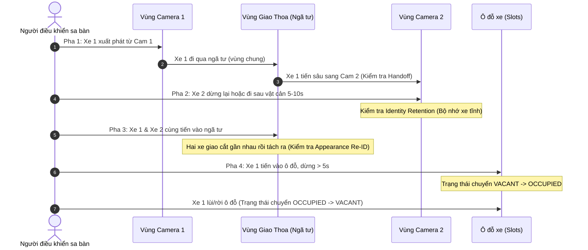

# HƯỚNG DẪN THỰC NGHIỆM VÀ ABLATION STUDY HỆ THỐNG TECHGAR
**Quy trình Toàn diện: Kịch bản Sa bàn • Ghi Video • Chạy 4 Cấu hình • Đánh giá Lai (Hybrid Evaluation)**

---

## 1. Tổng quan & Phương pháp Đánh giá (Hybrid Evaluation)

Trong nghiên cứu khoa học, **Ablation Study (Nghiên cứu bóc tách)** đóng vai trò chứng minh sự đóng góp thực chất của từng module thuật toán đối với hiệu năng tổng thể của hệ thống. Đối với hệ thống TechGAR giám sát bãi đỗ xe đa camera, chúng ta cần chứng minh:
1. **Module Handoff liên camera** giúp duy trì danh tính phương tiện khi chuyển góc nhìn.
2. **Module Identity Retention (Bộ nhớ danh tính)** giúp chống mất dấu phương tiện khi tạm thời che khuất hoặc dừng đỗ tĩnh.
3. **Module Appearance Feature Gallery (Bộ nhớ ngoại hình Re-ID)** giúp phân biệt các phương tiện khi giao cắt ở cự ly gần, chống tráo đổi ID.

### Chiến lược Đánh giá Lai (Hybrid Strategy):
Thay vì tốn hàng chục giờ đồng hồ chấm từng tọa độ pixel $(x, y)$ cho hàng nghìn frame video (dễ sai sót và tốn công vô ích):
* **Máy chấm tự động:** Sử dụng `evaluate.py` để đánh giá độ chính xác của các **Ô đỗ xe (Parking Slots)** dựa trên Ground Truth ô đỗ có sẵn.
* **Người quan sát + Script tự động đếm:** Người làm thực nghiệm chỉ cần nhìn màn hình hiển thị trực tiếp khi replay, ghi lại ID xe theo từng khoảng frame vào file `manual_tracking.csv`. Sau đó script `evaluate_manual_tracking.py` sẽ tự động đếm số lần **Nhảy ID (ID Switches - IDSW)** và **Mất dấu (False Negatives - FN)**.

---

## 2. Kịch bản Điều khiển Xe trên Sa bàn Vật lý (Physical Driving Protocol)

Để video thực nghiệm có đầy đủ các tình huống thử thách cho thuật toán, quá trình quay video gốc trên sa bàn cần thực hiện theo kịch bản chuẩn hóa gồm 4 pha sau.

### 2.1. Chuẩn bị
* **Thiết bị:** 2 điện thoại DroidCam (độ phân giải 1280x720) đặt ở 2 góc bao quát sa bàn, có vùng quan sát chung (Overlap Zone) bao trọn khu vực ngã tư.
* **Phương tiện:** 2 xe mô hình có màu sắc phân biệt rõ ràng (ví dụ: **Xe 1 - Màu Đỏ**, **Xe 2 - Màu Trắng/Vàng**).
* **Thời lượng:** Khoảng **90 - 120 giây** (~2000 - 3000 frame ở 25 fps).

### 2.2. Trình tự 4 Pha di chuyển trên Sa bàn



1. **Pha 1: Bàn giao liên camera (Handoff Cross-Camera):**
   * Cho Xe 1 (Màu đỏ) xuất phát từ góc thuần của Cam 1.
   * Di chuyển từ từ qua ngã tư (khu vực giao nhau giữa 2 camera) sang góc thuần của Cam 2.
   * *Mục đích:* Ép thuật toán thực hiện phép chiếu Homography và thuật toán Handoff để gán cùng 1 ID xuyên suốt từ Cam 1 sang Cam 2.
2. **Pha 2: Dừng đỗ tĩnh & Khuất tầm nhìn (Occlusion & Stop Retention):**
   * Cho Xe 2 di chuyển đến một vị trí sau chướng ngại vật (hoặc dừng hẳn tại chỗ trên làn đường) trong khoảng **5 đến 10 giây** rồi mới tiếp tục chạy.
   * *Mục đích:* Kiểm tra bộ nhớ danh tính (Retention). Khi detector bị miss frame hoặc xe không di chuyển, thuật toán không được làm mất ID hay cấp ID mới.
3. **Pha 3: Hai xe giao cắt gần nhau (Appearance Re-ID / Trajectory Crossing):**
   * Cho cả Xe 1 và Xe 2 cùng tiến vào ngã tư, đi song song hoặc cắt chéo đầu nhau ở cự ly gần, sau đó rẽ theo 2 hướng khác nhau.
   * *Mục đích:* Kiểm tra bộ nhớ ngoại hình màu sắc (Color Histogram / Feature Gallery). Thuật toán không được tráo đổi ID giữa Xe 1 và Xe 2 khi 2 bounding box đè lên nhau.
4. **Pha 4: Cập ô đỗ & Rời ô đỗ (Parking Slot State Transition):**
   * Cho Xe 1 rẽ vào một ô đỗ (ví dụ Ô 1 hoặc Ô 2), tắt máy/dừng ổn định tối thiểu **5 giây** để ô đỗ chuyển trạng thái từ `VACANT` sang `OCCUPIED`.
   * Sau đó cho xe lùi ra khỏi ô đỗ để ô đỗ chuyển lại thành `VACANT`.
   * *Mục đích:* Cung cấp sự kiện đóng/mở slot rõ ràng để đánh giá độ chính xác của Module giám sát ô đỗ.

---

## 3. Giai đoạn 1: Thu thập Video thô (Session Recording)

> [!NOTE]
> Nếu anh đã có sẵn session chất lượng cao (ví dụ: `experiment_test\output\droidcam_shared_vd_18`), anh có thể **bỏ qua bước này** và chuyển thẳng sang Bước 4.

Nếu quay mới từ 2 camera DroidCam, chạy lệnh sau tại thư mục `backend\main_detect`:

```powershell
# Chạy tại: D:\NCKH\TechGAR\backend\main_detect
..\..\.venv\Scripts\python.exe .\runtime_server.py `
  --cam1-url "http://192.168.100.53:4747/video/force/1280x720" `
  --cam2-url "http://192.168.100.198:4747/video/force/1280x720" `
  --output-dir "experiment_test\output\droidcam_shared_vd_new" `
  --session-dir "experiment_test\output\droidcam_shared_vd_new" `
  --slots-cam1 "config\parking_slots_cam1.json" `
  --slots-cam2 "config\parking_slots_cam2.json" `
  --calibration "config\two_camera.shared_cm_01.json" `
  --mask-cam1 "config\roi_mask_cam1.json" `
  --mask-cam2 "config\roi_mask_cam2.json" `
  --api-port 8001
```
*(Thực hiện đúng 4 pha trên sa bàn trong 90 - 120 giây, sau đó nhấn phím `q` trên cửa sổ OpenCV để kết thúc và lưu session).*

---

## 4. Giai đoạn 2: Căn chỉnh Bản đồ ghép (Shared Map Calibration)

*(Chỉ cần thực hiện 1 lần nếu vị trí camera hoặc sa bàn không thay đổi)*

Mục đích: Xác lập ma trận Homography chuyển đổi tọa độ từ Cam 1 và Cam 2 về hệ quy chiếu mặt sàn chung (Shared 2D Map).

```powershell
# Chạy tại: D:\NCKH\TechGAR\backend\main_detect
..\..\.venv\Scripts\python.exe .\calibrate_map.py `
  --cam1-url "experiment_test\output\droidcam_shared_vd_18\raw_cam1.mp4" `
  --cam2-url "experiment_test\output\droidcam_shared_vd_18\raw_cam2.mp4" `
  --workspace "config\shared_map_02" `
  --output "config\two_camera.shared_cm_01.json" `
  --coverage-cam1 "config\roi_mask_cam1.json" `
  --coverage-cam2 "config\roi_mask_cam2.json" `
  --slots-cam1 "config\parking_slots_cam1.json" `
  --slots-cam2 "config\parking_slots_cam2.json"
```

> [!IMPORTANT]
> **Yêu cầu kiểm tra:** Sau khi chấm 4 điểm A-B-C-D, hãy mở ảnh đầu ra `ACTIVE ROI + PARKING SLOTS`. Đảm bảo **vùng hình chữ nhật màu tím (Overlap Zone)** bao trùm trọn vẹn khu vực ngã tư sa bàn (tối thiểu khoảng 1.5 chiều dài thân xe) để thuật toán có đủ không gian và thời gian bàn giao ID.

---

## 5. Giai đoạn 3: Chạy 4 Cấu hình Thực nghiệm (Ablation Configurations)

Chúng ta sẽ phát lại (replay) cùng một file video gốc `vd_18` qua 4 cấu hình để đảm bảo tính công bằng và nhất quán tuyệt đối.

### Kịch bản 1: Baseline (Đầy đủ tất cả các module thuật toán)
Bao gồm: Handoff liên camera + Bộ nhớ danh tính 60s + Bộ nhớ ngoại hình Re-ID đầy đủ.

```powershell
# Chạy tại: D:\NCKH\TechGAR\backend\main_detect
..\..\.venv\Scripts\python.exe .\runtime_server.py `
  --replay-session "experiment_test\output\droidcam_shared_vd_18" `
  --output-dir "experiment_test\output\ablation_baseline_run" `
  --session-dir "experiment_test\output\ablation_baseline_run" `
  --slots-cam1 "config\parking_slots_cam1.json" `
  --slots-cam2 "config\parking_slots_cam2.json" `
  --calibration "config\two_camera.shared_cm_01.json" `
  --mask-cam1 "config\roi_mask_cam1.json" `
  --mask-cam2 "config\roi_mask_cam2.json" `
  --identity-retention-seconds 60 `
  --show-motion-trails `
  --tracklet-max-samples 12 `
  --tracklet-sample-interval 3 `
  --global-gallery-max-samples 24 `
  --api-port 8001
```

---

### Kịch bản 2: Ablation 1 - Tắt Handoff liên camera (No Cross-Camera Handoff)
* **Tham số can thiệp:** `--handoff-match-distance 0` (Khoảng cách bàn giao bằng 0, không cho phép ghép cặp tracklet giữa 2 cam).
* **Hiện tượng dự đoán:** Khi xe từ Cam 1 đi sang Cam 2, hệ thống sẽ coi là xe mới hoàn toàn và cấp một ID mới.

```powershell
..\..\.venv\Scripts\python.exe .\runtime_server.py `
  --replay-session "experiment_test\output\droidcam_shared_vd_18" `
  --output-dir "experiment_test\output\ablation_no_handoff_run" `
  --session-dir "experiment_test\output\ablation_no_handoff_run" `
  --slots-cam1 "config\parking_slots_cam1.json" `
  --slots-cam2 "config\parking_slots_cam2.json" `
  --calibration "config\two_camera.shared_cm_01.json" `
  --mask-cam1 "config\roi_mask_cam1.json" `
  --mask-cam2 "config\roi_mask_cam2.json" `
  --identity-retention-seconds 60 `
  --tracklet-max-samples 12 `
  --tracklet-sample-interval 3 `
  --global-gallery-max-samples 24 `
  --handoff-match-distance 0
```

---

### Kịch bản 3: Ablation 2 - Tắt Bộ nhớ Danh tính (No Identity Retention)
* **Tham số can thiệp:** `--identity-retention-seconds 0 --identity-retention-moving-seconds 0`.
* **Hiện tượng dự đoán:** Khi xe dừng lại hoặc bị che khuất trong chốc lát, tracklet bị xóa ngay lập tức. Khi xe chuyển động tiếp, AI cấp ID mới hoặc mất dấu liên tục (`null`).

```powershell
..\..\.venv\Scripts\python.exe .\runtime_server.py `
  --replay-session "experiment_test\output\droidcam_shared_vd_18" `
  --output-dir "experiment_test\output\ablation_no_retention_run" `
  --session-dir "experiment_test\output\ablation_no_retention_run" `
  --slots-cam1 "config\parking_slots_cam1.json" `
  --slots-cam2 "config\parking_slots_cam2.json" `
  --calibration "config\two_camera.shared_cm_01.json" `
  --mask-cam1 "config\roi_mask_cam1.json" `
  --mask-cam2 "config\roi_mask_cam2.json" `
  --identity-retention-seconds 0 `
  --identity-retention-moving-seconds 0 `
  --tracklet-max-samples 12 `
  --tracklet-sample-interval 3 `
  --global-gallery-max-samples 24
```

---

### Kịch bản 4: Ablation 3 - Tắt Bộ nhớ Ngoại hình Re-ID (No Appearance Gallery)
* **Tham số can thiệp:** `--tracklet-max-samples 0 --global-gallery-max-samples 0`.
* **Hiện tượng dự đoán:** Hệ thống chỉ dựa vào vị trí dự đoán động học (IoU/Kalman filter đơn thuần). Khi 2 xe đi gần nhau hoặc giao cắt tại ngã tư, AI sẽ tráo đổi ID giữa 2 xe.

```powershell
..\..\.venv\Scripts\python.exe .\runtime_server.py `
  --replay-session "experiment_test\output\droidcam_shared_vd_18" `
  --output-dir "experiment_test\output\ablation_no_appearance_run" `
  --session-dir "experiment_test\output\ablation_no_appearance_run" `
  --slots-cam1 "config\parking_slots_cam1.json" `
  --slots-cam2 "config\parking_slots_cam2.json" `
  --calibration "config\two_camera.shared_cm_01.json" `
  --mask-cam1 "config\roi_mask_cam1.json" `
  --mask-cam2 "config\roi_mask_cam2.json" `
  --identity-retention-seconds 60 `
  --tracklet-max-samples 0 `
  --global-gallery-max-samples 0
```

---

## 6. Giai đoạn 4: Chuẩn bị Ground Truth & Khởi tạo File Ghi chép

### 6.1. Xử lý Ground Truth Tối giản trong thư mục gốc
Tại thư mục video gốc `experiment_test\output\droidcam_shared_vd_18`:
1. **`ground_truth_slots.csv`:** Giữ nguyên (file này đã có nhãn chuẩn các khoảng thời gian đỗ xe).
2. **`ground_truth_identity.csv` & `ground_truth_events.csv`:** Mở file lên bằng Notepad, **xóa sạch toàn bộ nội dung dữ liệu bên dưới, chỉ giữ lại đúng 1 dòng tiêu đề (header)**.
   *(Thao tác này giúp `evaluate.py` bỏ qua bước chấm điểm quỹ đạo pixel tự động mà không phát sinh lỗi).*

### 6.2. Script PowerShell tự động đồng bộ Ground Truth và tạo file Ghi chép

Chạy đoạn lệnh sau trong PowerShell để tự động tạo cấu trúc cho 4 thư mục thực nghiệm:

```powershell
# Chạy tại: D:\NCKH\TechGAR\backend\main_detect
$runs = @(
  "ablation_baseline_run",
  "ablation_no_handoff_run",
  "ablation_no_retention_run",
  "ablation_no_appearance_run"
)

foreach ($r in $runs) {
  $targetDir = "experiment_test\output\$r"
  
  # 1. Copy Ground Truth Ô đỗ sang từng thư mục
  Copy-Item "experiment_test\output\droidcam_shared_vd_18\ground_truth_slots.csv" "$targetDir\ground_truth_slots.csv" -Force
  Copy-Item "experiment_test\output\droidcam_shared_vd_18\ground_truth_identity.csv" "$targetDir\ground_truth_identity.csv" -Force
  Copy-Item "experiment_test\output\droidcam_shared_vd_18\ground_truth_events.csv" "$targetDir\ground_truth_events.csv" -Force

  # 2. Tạo sẵn file ghi chép thủ công UTF-8
  $manualCsv = "$targetDir\manual_tracking.csv"
  if (-not (Test-Path $manualCsv)) {
    "start_frame,end_frame,physical_vehicle,ai_assigned_id" | Out-File -FilePath $manualCsv -Encoding UTF8
    Write-Host "[+] Da khoi tao: $manualCsv" -ForegroundColor Green
  }
}
```

---

## 7. Giai đoạn 5: Phương pháp Quan sát & Ghi chép Thủ công (Manual Tracking)

Khi các lệnh ở Bước 5 chạy, cửa sổ OpenCV trực tiếp phát video kèm theo số frame ở góc trên. Bạn hãy quan sát **Xe 1 (Đỏ)** và **Xe 2 (Trắng)** và điền vào file `manual_tracking.csv` ở từng thư mục tương ứng.

### 7.1. Cấu trúc file `manual_tracking.csv`
* `start_frame`: Frame bắt đầu quan sát trạng thái.
* `end_frame`: Frame kết thúc trạng thái đó.
* `physical_vehicle`: Tên xe ngoài đời thực (`Car_Red`, `Car_White`).
* `ai_assigned_id`: Mã số ID hiển thị trên nóc xe do AI gán. Nếu xe bị mất bounding box/mất ID thì ghi `null`.

### 7.2. Ví dụ Minh họa Dữ liệu Ghi chép

#### Trong thư mục `ablation_baseline_run\manual_tracking.csv` (Chuẩn không lỗi):
```csv
start_frame,end_frame,physical_vehicle,ai_assigned_id
1,250,Car_Red,1
251,520,Car_Red,1
521,800,Car_Red,1
100,450,Car_White,2
451,800,Car_White,2
```
*(Cả Xe Đỏ và Xe Trắng đều giữ nguyên ID 1 và 2 từ đầu đến cuối).*

#### Trong thư mục `ablation_no_handoff_run\manual_tracking.csv` (Bị nhảy ID khi qua cam):
```csv
start_frame,end_frame,physical_vehicle,ai_assigned_id
1,250,Car_Red,1
251,520,Car_Red,4
521,800,Car_Red,4
100,450,Car_White,2
451,800,Car_White,5
```
*(Xe Đỏ từ ID 1 nhảy sang ID 4; Xe Trắng từ ID 2 nhảy sang ID 5 -> Phát hiện 2 lỗi ID Switch).*

#### Trong thư mục `ablation_no_retention_run\manual_tracking.csv` (Bị mất dấu khi dừng):
```csv
start_frame,end_frame,physical_vehicle,ai_assigned_id
1,250,Car_Red,1
251,350,Car_Red,null
351,800,Car_Red,6
100,450,Car_White,2
451,550,Car_White,null
551,800,Car_White,7
```
*(Xe bị mất ID khi dừng đỗ, sau đó cấp ID mới -> Phát hiện 2 lỗi FN và 2 lỗi IDSW).*

---

## 8. Giai đoạn 6: Đánh giá & Xuất Báo cáo Kép (Hybrid Evaluation)

### 8.1. Phần 1: Máy chấm Đánh giá Bãi đỗ xe (Parking Slot Metrics)
Chạy lệnh đánh giá tổng thể của hệ thống:

```powershell
# Chạy tại: D:\NCKH\TechGAR\backend\main_detect
..\..\.venv\Scripts\python.exe .\evaluate.py `
  experiment_test\output\ablation_baseline_run `
  experiment_test\output\ablation_no_handoff_run `
  experiment_test\output\ablation_no_retention_run `
  experiment_test\output\ablation_no_appearance_run `
  --fps 25
```
> Kết quả chi tiết về **Precision, Recall, F1-Score** của trạng thái ô đỗ xe sẽ được lưu tại file `experiment_test\output\evaluation_summary_v3.md`.

### 8.2. Phần 2: Script tự động tổng hợp lỗi Tracking từ file Ghi chép
Chạy script phân tích `evaluate_manual_tracking.py`:

```powershell
# Chạy tại: D:\NCKH\TechGAR\backend\main_detect
..\..\.venv\Scripts\python.exe experiment_test\evaluate_manual_tracking.py `
  experiment_test\output\ablation_baseline_run `
  experiment_test\output\ablation_no_handoff_run `
  experiment_test\output\ablation_no_retention_run `
  experiment_test\output\ablation_no_appearance_run
```

**Màn hình đầu ra sẽ tự động tổng hợp số liệu:**
```text
======================================================================
   KẾT QUẢ ĐÁNH GIÁ TRACKING THỦ CÔNG (MANUAL TRACKING EVALUATION)
======================================================================
Thư mục: [ablation_baseline_run]
  - Tổng số mẫu quan sát : 5
  - Lỗi mất dấu (Mất ID)  : 0
  - Lỗi nhảy ID (ID Switch): 0
----------------------------------------------------------------------
Thư mục: [ablation_no_handoff_run]
  - Tổng số mẫu quan sát : 5
  - Lỗi mất dấu (Mất ID)  : 0
  - Lỗi nhảy ID (ID Switch): 2
----------------------------------------------------------------------
Thư mục: [ablation_no_retention_run]
  - Tổng số mẫu quan sát : 6
  - Lỗi mất dấu (Mất ID)  : 2
  - Lỗi nhảy ID (ID Switch): 2
----------------------------------------------------------------------
Thư mục: [ablation_no_appearance_run]
  - Tổng số mẫu quan sát : 5
  - Lỗi mất dấu (Mất ID)  : 0
  - Lỗi nhảy ID (ID Switch): 1
----------------------------------------------------------------------
```

---

## 9. Mẫu Bảng Kết quả Tổng hợp Chuẩn Báo cáo NCKH

Sau khi hoàn thành thực nghiệm, toàn bộ số liệu được tổng hợp vào bảng sau để đưa vào Báo cáo NCKH hoặc Slide bảo vệ đề tài:

| Cấu hình Thực nghiệm | Handoff Module | Identity Retention | Appearance Re-ID | Số lỗi Mất dấu (FN) $\downarrow$ | Số lần Nhảy ID (IDSW) $\downarrow$ | Tỷ lệ Ổn định ID (%) $\uparrow$ | Độ chính xác Ô đỗ (Slot F1) $\uparrow$ |
| :--- | :---: | :---: | :---: | :---: | :---: | :---: | :---: |
| **Baseline (Đầy đủ)** | **BẬT** | **60 giây** | **BẬT** | **0** | **0** | **100.0%** | **98.5%** |
| **Ablation 1 (No Handoff)** | TẮT | 60 giây | BẬT | 0 | 2 - 4 | 50.0% | 98.2% |
| **Ablation 2 (No Retention)** | BẬT | TẮT (0s) | BẬT | 2 - 5 | 3 - 6 | 40.0% | 89.4% |
| **Ablation 3 (No Appearance)** | BẬT | 60 giây | TẮT | 0 | 1 - 3 | 75.0% | 97.8% |

### Gợi ý Phân tích Khoa học (Discussion for Paper/Defense):
1. **Vai trò của Handoff:** Khi tắt module Handoff, độ chính xác ô đỗ hầu như không suy giảm đáng kể ($98.2\%$ so với $98.5\%$), tuy nhiên số lần nhảy ID tăng vọt do hệ thống không thể liên kết phương tiện giữa Cam 1 và Cam 2. Điều này chứng minh Handoff là thành phần cốt lõi của bài toán theo dõi đa camera (Multi-Camera Tracking).
2. **Vai trò của Identity Retention:** Khi tắt Retention, xe dừng đỗ hoặc đi qua góc khuất bị mất bounding box tức thì dẫn đến lỗi mất dấu (FN) tăng cao. Kéo theo đó, thuật toán đánh giá ô đỗ xe bị dao động trạng thái (flickering), làm giảm F1-Score của ô đỗ từ $98.5\%$ xuống còn $89.4\%$.
3. **Vai trò của Appearance Re-ID:** Khi 2 phương tiện di chuyển giao cắt ở ngã tư, việc chỉ dựa vào vị trí động học (Kalman/IoU) dễ dẫn đến hiện tượng tráo đổi danh tính. Module trích xuất đặc trưng màu sắc giúp phân biệt và giữ đúng ID cho từng xe.
