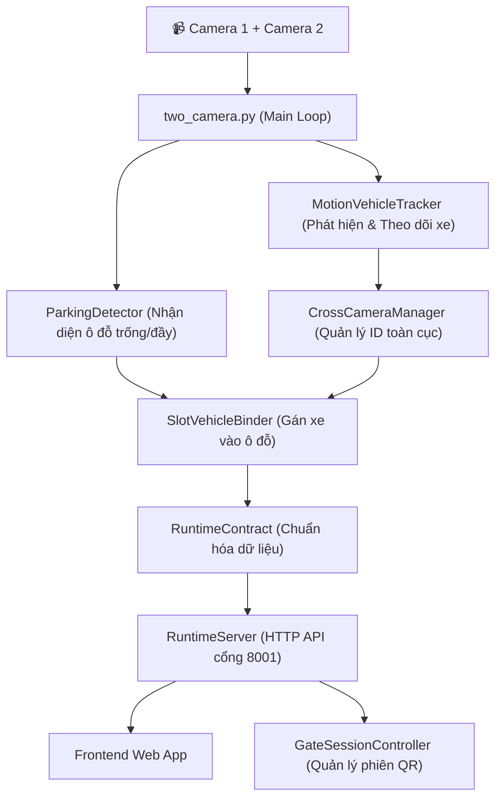
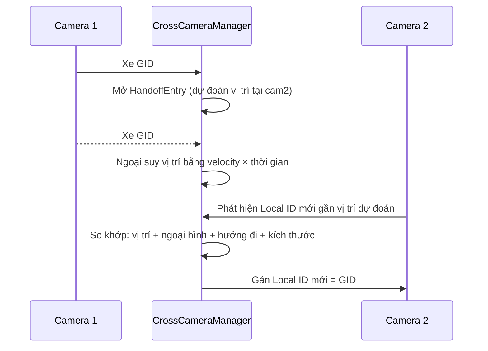
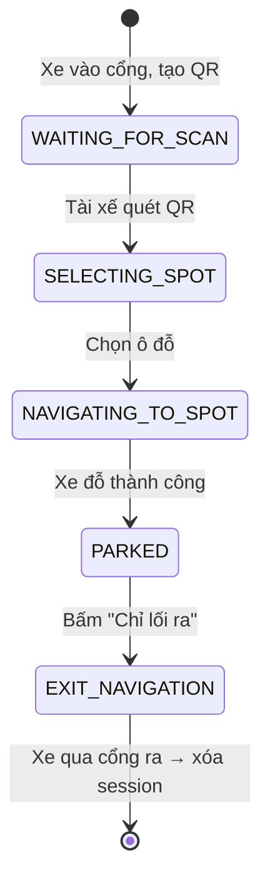

# Phân Tích Chi Tiết Backend TechGAR Parking

> **Mục đích:** Tài liệu giải thích toàn bộ luồng xử lý, các thuật toán chính và kiến trúc code của hệ thống backend TechGAR Smart Parking.

---

## 1. Tổng Quan Kiến Trúc



Hệ thống gồm **3 tiến trình** chạy song song:

| Tiến trình | File | Cổng | Vai trò |
|---|---|---|---|
| **Runtime Server** | `runtime_server.py` | 8001 | Xử lý video, tracking, phát API |
| **Gate Session** | `gate_session_controller.py` | 8000 | Quản lý phiên xe qua QR |
| **Frontend** | `npm run dev` | 5173 | Giao diện web cho tài xế |

---

## 2. Luồng Xử Lý Chính (Main Pipeline)

### 2.1. Khởi Tạo (`two_camera.py` → `run()`)

Khi chạy `runtime_server.py`, hệ thống:

1. **Đọc nguồn video**: Từ camera live (DroidCam URL) hoặc video replay (`.mp4`)
2. **Load calibration**: Đọc file JSON chứa ma trận Homography để ánh xạ 2 camera vào bản đồ chung
3. **Khởi tạo các module:**
   - 2x `MotionVehicleTracker` — mỗi camera một tracker
   - 2x `ParkingDetector` — mỗi camera một detector ô đỗ
   - 2x `SlotVehicleBinder` — gán xe ↔ ô đỗ
   - 1x `CrossCameraManager` — quản lý ID xe xuyên camera

### 2.2. Vòng Lặp Frame-by-Frame

```
Mỗi frame lặp lại:
┌─────────────────────────────────────────────┐
│ 1. Đọc cặp frame đồng bộ từ 2 camera       │
│ 2. Chạy ParkingDetector (2 Hz)              │
│ 3. Chạy MotionTracker trên mỗi camera      │
│ 4. Slot Recovery: khôi phục ID xe rời ô     │
│ 5. CrossCameraManager: cấp/hợp nhất GID    │
│ 6. SlotVehicleBinder: gán xe vào ô đỗ      │
│ 7. Publish snapshot lên RuntimeServer API   │
└─────────────────────────────────────────────┘
```

---

## 3. Các Thuật Toán Chính

### 3.1. Motion Vehicle Tracker (`motion_tracker.py`)

**Mục đích:** Phát hiện và theo dõi xe đang di chuyển mà KHÔNG cần mô hình AI (YOLO).

> [!NOTE]
> Thuật toán này được thiết kế cho camera nhìn từ trên cao (top-down), nơi mà YOLO không nhận diện được xe quá nhỏ. Thay vào đó, nó dùng **foreground motion** (phát hiện chuyển động pixel).

#### Bước 1: Phát hiện foreground (MOG2 + Temporal Motion)

```
Frame hiện tại
      │
      ├──→ MOG2 Background Subtractor (tách nền/tiền cảnh)
      │         → background_mask
      │
      └──→ Temporal Frame Difference (so sánh frame cũ-mới)
                → temporal_motion_mask
                
Kết quả = background_mask AND temporal_motion_mask (loại bỏ xe đứng yên)
```

- **MOG2** (`cv2.createBackgroundSubtractorMOG2`): Học mô hình nền, đánh dấu pixel thay đổi
- **Temporal Motion**: So sánh frame hiện tại với frame cách đó ~0.25s (ngắn) và ~0.8s (dài)
  - Trừ đi **median brightness shift** trước khi so sánh → tránh nhận nhầm thay đổi ánh sáng toàn cục thành xe
- Kết hợp bằng AND: chỉ pixel **vừa là foreground MOG2** VÀ **vừa thực sự di chuyển** mới được giữ

#### Bước 2: Trích xuất Detection từ Contour

```python
contours = cv2.findContours(mask)
for contour in contours:
    # Lọc theo: diện tích tối thiểu, tỷ lệ khung hình, kích thước tối đa
    # Lọc theo: số pixel motion thực sự bên trong bbox
    # Lọc theo: loại bỏ bóng đổ (Cast Shadow Rejection)
    # → Tạo detection {box, point, histogram}
```

**Cast Shadow Rejection:** Phân biệt bóng đổ với xe thật bằng cách:
- Bóng đổ = nền bị tối đi đều (attenuation ~0.32-0.62) nhưng **giữ nguyên màu sắc** (chromaticity)
- Xe thật = che khuất texture nền, thay đổi màu sắc hoàn toàn

#### Bước 3: Data Association (LAPJV)

Ghép cặp detection ↔ track đang tồn tại bằng **Linear Assignment** (thuật toán Jonker-Volgenant):

```
Ma trận chi phí (cost matrix):
  cost = 0.45 × khoảng cách pixel (Kalman predict ↔ detection)
       + 0.25 × (1 - IoU)
       + 0.20 × khoảng cách ngoại hình (Bhattacharyya histogram)
       + 0.10 × sai lệch kích thước
```

- **Kalman Filter** (constant-velocity model): Dự đoán vị trí tiếp theo của mỗi track
- **LAPJV**: Giải bài toán gán tối ưu toàn cục → tránh 2 track tranh nhau 1 detection

#### Bước 4: Quản lý vòng đời Track

```
TENTATIVE ──(đủ N lần nhìn thấy)──→ CONFIRMED ──(mất tín hiệu)──→ LOST ──(hết TTL)──→ Xóa
```

---

### 3.2. Parking Detector (`parking_detector.py`)

**Mục đích:** Xác định mỗi ô đỗ xe đang **trống** hay **có xe** (KHÔNG theo dõi xe, chỉ phân loại trạng thái ô).

> [!IMPORTANT]
> Đây là thuật toán hoàn toàn dựa trên **xử lý ảnh cổ điển** (image processing), không dùng Deep Learning.

#### Thuật toán Ensemble Voting (25 biến thể)

```
Input: 1 frame BGR
  │
  ├─→ Chuyển sang LAB color space, lấy kênh L (lightness)
  │
  └─→ Tạo 25 biến thể = 5 mức Gamma × 5 mức CLAHE:
       Gamma: [-0.2, -0.1, 0.0, +0.1, +0.2] quanh base_gamma
       CLAHE: [-0.5, -0.2, 0.0, +0.2, +0.5] quanh base_clahe
       
       Mỗi biến thể:
         1. CLAHE normalize → Gamma correction → GaussianBlur
         2. Adaptive Threshold (nhị phân hóa)
         3. Median filter + Dilate
         4. Đếm pixel trắng trong mỗi ô đỗ
         5. Nếu tỷ lệ < ratio_thr → vote "TRỐNG"
       
       Kết quả: 25 phiếu bầu cho mỗi ô
       Nếu ≥ 13/25 vote "TRỐNG" → ô đó TRỐNG (sơ bộ)
```

**Tại sao dùng Ensemble?** Mỗi mức Gamma/CLAHE nhạy với loại xe khác nhau. Xe trắng dễ bị miss ở gamma cao, xe đen dễ bị miss ở gamma thấp. Bỏ phiếu đa số giúp ổn định.

#### Pass 1: Center Cluster Rescue

```
Nếu vote nói "TRỐNG" nhưng vùng lõi (core, 55% diện tích giữa ô) 
có cụm pixel đen đủ lớn → Cứu lại thành "CÓ XE"
```
- Loại bỏ vạch kẻ mỏng chạm viền (border-connected thin components)
- Giữ lại blob dày nằm ở trung tâm ô → đó là xe

#### Pass 2: Temporal Smoothing

```
Trạng thái chỉ đổi khi N frame liên tiếp đồng thuận (mặc định N=5)
→ Tránh nhấp nháy khi ánh sáng thay đổi thoáng qua
```

---

### 3.3. Cross Camera Manager (`cross_camera_manager.py`)

**Mục đích:** Duy trì **Global ID (GID)** duy nhất cho mỗi xe khi nó di chuyển giữa 2 camera.

> [!IMPORTANT]
> Đây là module phức tạp nhất (~5600 dòng). Mỗi camera có tracker riêng với Local ID riêng. Module này ánh xạ Local ID → Global ID thống nhất.

#### Khái niệm cốt lõi

| Thuật ngữ | Ý nghĩa |
|---|---|
| **Local ID** | ID do tracker mỗi camera tự cấp (cam1: #1, #2... cam2: #1, #2...) |
| **Global ID (GID)** | ID duy nhất toàn hệ thống, gán bởi CrossCameraManager |
| **Handoff** | Chuyển giao xe từ camera A sang camera B |
| **Dormant** | Xe tạm mất tín hiệu nhưng chưa rời bãi |
| **World coordinates** | Tọa độ trên bản đồ chung (qua Homography) |

#### Cơ chế Handoff (Chuyển giao xuyên camera)



**Chi tiết matching:**
- **Spatial**: Khoảng cách trên shared world map ≤ `prediction_radius`
- **Appearance**: Khoảng cách HSV histogram (Bhattacharyya) ≤ `appearance_threshold`
- **Direction**: Cosine hướng đi ≥ `min_direction_cosine` (tránh gán xe đi ngược)
- **Size**: Kích thước bbox tương đồng

#### Cơ chế cấp GID mới

Không phải detection nào cũng được cấp GID ngay. Phải thỏa:
1. Đã quan sát ≥ 5 frame (`new_identity_min_observations`)
2. Đã di chuyển ≥ 15% đường chéo bbox (`min_displacement_ratio`)
3. Không trùng khớp với xe dormant hay handoff nào

→ **Tránh cấp GID cho bóng đổ, nhiễu, hay reflection.**

#### World Trajectory Memory (`trajectory_memory.py`)

Lưu quỹ đạo di chuyển trên bản đồ chung (2 giây gần nhất) để hỗ trợ Re-ID:

```
Score = 0.35 × corridor_distance (gần đường đi cũ?)
      + 0.25 × appearance (ngoại hình giống?)
      + 0.15 × direction (cùng hướng?)
      + 0.10 × speed (tốc độ tương đồng?)
      + 0.10 × time+topology (thời gian gap + đúng camera kề?)
      + 0.05 × size (kích thước?)
```

---

### 3.4. Slot Vehicle Binder (`slot_vehicle_binder.py`)

**Mục đích:** Gán Global ID của xe vào ô đỗ cụ thể, xử lý sự kiện xe đỗ/rời ô.

#### Nguyên tắc hoạt động

```
ParkingDetector: "Ô A01 có xe" (vision)
MotionTracker:   "GID#5 đang dừng tại vị trí trùng A01" (tracking)
    ↓
SlotVehicleBinder: Gán A01 ← GID#5
```

**Quy tắc an toàn:**
- Tracking **chỉ có thể** biến ô trống thành có xe (nếu xe dừng đủ lâu)
- Tracking **KHÔNG BAO GIỜ** biến ô có xe thành trống
- Vision (ParkingDetector) là nguồn chính cho trạng thái trống/đầy

#### Phát hiện xe đỗ (Stationary Detection)

```
Xe GID#5 liên tục nằm trong polygon ô A01:
  - Overlap ≥ 35% (hoặc ≥ 60% nếu tâm nằm ngoài)
  - Dừng ≥ 1 giây (drift < 6% đường chéo ô)
  - Có ≥ 8 mẫu quan sát
  → Kết luận: GID#5 đã đỗ tại A01
```

#### Departure Token (Khôi phục ID xe rời ô)

Khi xe rời ô đỗ, motion tracker thường **mất track** (vì xe đứng yên → bắt đầu động → tạo track mới). Binder tạo **Departure Token** để giữ GID cũ:

```
1. Xe GID#5 đang đỗ tại A01
2. ParkingDetector báo A01 trống → Tạo DepartureToken {GID#5, A01, 5 giây}
3. Tracker phát hiện detection mới gần A01
4. So khớp: vị trí + ngoại hình + hướng rời ô + kích thước
5. Nếu khớp → Gán detection mới = GID#5 (không tạo ID mới)
```

**Điều kiện khôi phục (rất chặt):**
- ≥ 3 frame liên tiếp quan sát
- Appearance ≤ 0.62 (histogram distance)
- Di chuyển ra xa tâm ô (radial gain > 0)
- Kích thước hợp lý (ratio 0.40 – 2.50)

#### Arrival Claim (Nhận diện xe vào ô)

Motion tracker mất track khi xe dừng hẳn. Arrival Claim lưu bằng chứng:

```
1. GID#5 di chuyển qua polygon A01 với overlap tăng dần
2. GID#5 biến mất (tracker mất tín hiệu)
3. Sau 0.35s, ParkingDetector xác nhận A01 occupied (2 lần liên tiếp)
4. → Commit: A01 ← GID#5
```

---

### 3.5. Appearance Descriptor (`tracklet_descriptor.py`)

**Mục đích:** Mô tả ngoại hình xe bằng histogram màu để so khớp (Re-ID).

#### Cấu trúc Descriptor (416 chiều)

```
Descriptor = [HSV Hue×Sat 16×16] × 0.70    (256 giá trị)
           + [LAB a×b 12×12]     × 1.20    (144 giá trị)  
           + [LAB Luminance 16]  × 0.60    ( 16 giá trị)
           → Normalize L2                   = 416 chiều
```

- **HSV**: Phân biệt màu sắc (đỏ/xanh/vàng...)
- **LAB chromaticity**: Phân biệt xe trắng/đen/xám mà HSV bỏ sót
- **Luminance**: Thêm thông tin sáng/tối

#### So khớp Gallery-to-Gallery

Mỗi track lưu gallery ~12 histogram (lấy mẫu cách 3 frame). Khi so khớp 2 xe:

```
Khoảng cách = 0.50 × median nearest-neighbor (gallery nhỏ → gallery lớn)
            + 0.20 × median symmetric nearest
            + 0.20 × aggregate histogram distance
            + 0.10 × mean top-3 best pairs
```

---

### 3.6. Calibration (`calibrate_map.py`)

**Mục đích:** Tạo ánh xạ Homography giữa 2 camera qua một hình chữ nhật tham chiếu trên mặt bãi.

#### Quy trình

```
1. Chụp 1 frame từ mỗi camera
2. Người dùng đánh dấu 4 góc A-B-C-D của cùng 1 hình chữ nhật trên mặt bãi
   (trên cả 2 camera)
3. Tính Homography:
   - cam1_H: cam1_pixel → world_coordinate
   - cam2_H: cam2_pixel → world_coordinate
4. Tính vùng overlap: đa giác mà cả 2 camera cùng nhìn thấy
5. Lưu ra JSON: {camera_transforms, overlap_world_polygon, edge_adjacency}
```

**Homography** là ma trận 3×3 cho phép chiếu điểm ảnh từ camera lên mặt phẳng sàn (world plane).

---

### 3.7. Direction Detector (`direction_detector.py`)

**Mục đích:** Xác định xe rẽ trái/phải/đi thẳng tại ngã rẽ.

```
1. Định nghĩa ROI lines (vạch tưởng tượng tại ngã rẽ)
2. Phát hiện xe cắt qua vạch (segment intersection test)
3. Sau K frame, so vector hướng TRƯỚC và SAU vạch:
   - Cross product > 0 → TURN_LEFT
   - Cross product < 0 → TURN_RIGHT  
   - Góc < 20° → STRAIGHT
```

---

## 4. Runtime Server & API (`runtime_server.py`)

Server HTTP phục vụ dữ liệu realtime cho Frontend:

| Endpoint | Method | Mô tả |
|---|---|---|
| `/api/runtime/status` | GET | Trạng thái: đang chạy? frame bao nhiêu? camera nào online? |
| `/api/runtime/snapshot` | GET | **Toàn bộ dữ liệu**: ô đỗ, xe, vị trí, sự kiện |
| `/api/runtime/map` | GET | Layout ô đỗ trên bản đồ (tọa độ world) |
| `/api/runtime/cameras/{id}.jpg` | GET | Ảnh JPEG frame mới nhất |
| `/api/runtime/cameras/{id}.mjpg` | GET | Stream MJPEG liên tục |
| `/api/runtime/gates` | GET/POST | Cấu hình cổng vào/ra |

**Snapshot payload** (chuẩn hóa bởi `runtime_contract.py`):
```json
{
  "schema_version": 1,
  "frame_index": 857,
  "source_mode": "live|replay",
  "parking_slots": [{"slot_id": "A01", "occupied": true, "vehicle_id": 5, ...}],
  "vehicles": [{"global_id": 5, "state": "active", "position": {"x": ..., "y": ...}}],
  "cameras": {"cam1": {"online": true, "width": 1280, "height": 720}},
  "recent_events": [...]
}
```

---

## 5. Gate Session Controller (`gate_session_controller.py`)

**Mục đích:** Quản lý phiên xe (entry → chọn ô → dẫn đường → đỗ → ra cổng) thông qua QR code.



**Luồng hoạt động:**
1. Poll `/api/runtime/snapshot` từ RuntimeServer mỗi giây
2. Phát hiện xe mới vào cổng → Tạo session + QR code
3. Khi tài xế quét QR → Gán `global_vehicle_id` cho session
4. Theo dõi xe đỗ: kiểm tra `stopped_for_ms ≥ 2000` tại ô đã chọn
5. Phát hiện xe qua cổng ra → Xóa session

---

## 6. Bản Đồ Module

```
backend/
├── main_detect/
│   ├── two_camera.py            # 🔴 ĐIỀU PHỐI CHÍNH: vòng lặp frame, kết nối mọi module
│   ├── runtime_server.py        # HTTP API server (cổng 8001)
│   ├── calibrate_map.py         # Tool vẽ calibrate 2 camera
│   ├── run_two_camera_session.py # Entry point: chạy live hoặc replay
│   └── src/techgar/
│       ├── motion_tracker.py      # 🟢 Phát hiện + theo dõi xe bằng motion
│       ├── vehicle_tracker.py     # 🟢 Phát hiện + theo dõi xe bằng YOLO (thay thế)
│       ├── parking_detector.py    # 🟡 Nhận diện ô đỗ trống/đầy (ensemble voting)
│       ├── cross_camera_manager.py# 🔵 Quản lý Global ID xuyên camera
│       ├── slot_vehicle_binder.py # 🟣 Gán xe ↔ ô đỗ + recovery token
│       ├── tracklet_descriptor.py # Mô tả ngoại hình xe (HSV+LAB histogram)
│       ├── trajectory_memory.py   # Bộ nhớ quỹ đạo world-map
│       ├── direction_detector.py  # Phát hiện hướng rẽ tại ngã rẽ
│       ├── latest_frame_capture.py# Đọc frame mới nhất từ stream (bỏ frame cũ)
│       ├── runtime_contract.py    # Chuẩn hóa snapshot cho API
│       └── prediction_writer.py   # Ghi predictions ra file
├── gate_session_controller.py   # Quản lý phiên xe + QR
└── session_manager.py           # CRUD session data
```

---

## 7. Tóm Tắt Các Thuật Toán Theo Tầng

| Tầng | Module | Thuật toán | Thư viện |
|---|---|---|---|
| **Phát hiện xe** | `motion_tracker` | MOG2 + Temporal Frame Diff + Contour | OpenCV |
| **Theo dõi xe** | `motion_tracker` | Kalman Filter + LAPJV Assignment | OpenCV + lap |
| **Ngoại hình** | `tracklet_descriptor` | HSV+LAB Histogram + Bhattacharyya | OpenCV |
| **Nhận diện ô đỗ** | `parking_detector` | 25-variant Ensemble + Adaptive Threshold | OpenCV |
| **ID xuyên camera** | `cross_camera_manager` | Homography Projection + LAPJV + Gallery Matching | OpenCV + numpy |
| **Gán xe↔ô** | `slot_vehicle_binder` | Polygon Overlap + Stationary Detection + Token Recovery | OpenCV |
| **Quỹ đạo** | `trajectory_memory` | Point-to-Segment Distance + Velocity Extrapolation | numpy |
| **Hướng rẽ** | `direction_detector` | Segment Intersection + Cross Product Angle | numpy |
| **Đồng bộ camera** | `latest_frame_capture` | Background Thread + Condition Variable | threading |
| **Calibration** | `calibrate_map` | 4-point Homography (`cv2.getPerspectiveTransform`) | OpenCV |
